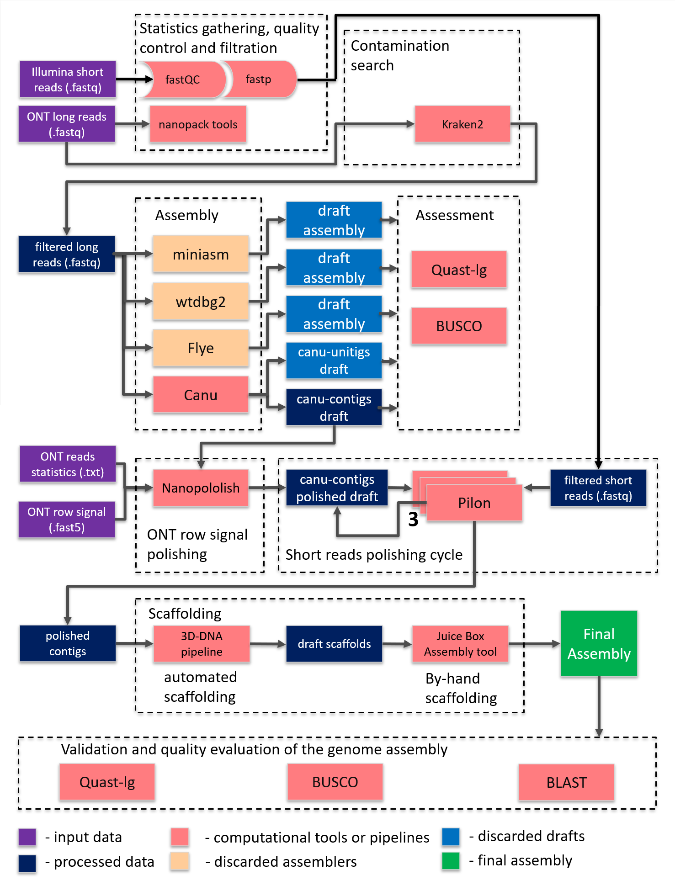

# Mosquitoes_genome_assembly
Scripts used in mosquitoes genome assembly and validation processes.
### Assembly pipeline

### Data qc, statistics gathering, and filtration
[ONT data qc and statistics](/data_stats_qc_filtration/ONT_long_reads/qc_and_statistics.md)

[Illumina data qc](/data_stats_qc_filtration/Illumina_data/qc.md)

[Illumina data filtration](/data_stats_qc_filtration/Illumina_data/filtration.md)
### Contamination filtering

[Kraken2 classification](/contamination_search/kraken2.md)
### Draft assembly stage
[miniasm assembly](/draft_assembly/miniasm.md)

[wtdbg2 assembly](/draft_assembly/wtdbg2.md)

[Flye assembly](/draft_assembly/flye.md)

[CANU assembly](/draft_assembly/canu.md)
### Assembly assesment
[QUAST-lg assesment](/assembly_assesment/quast.md)

[BUSCO assesment](/assembly_assesment/busco.md)

### Assembly polishing

[Nanopolish polishing with ONT raw signal](/polishing/nanopolish.md)

[Pilon polishing with Illumina data](/draft_assembly/canu.md)

