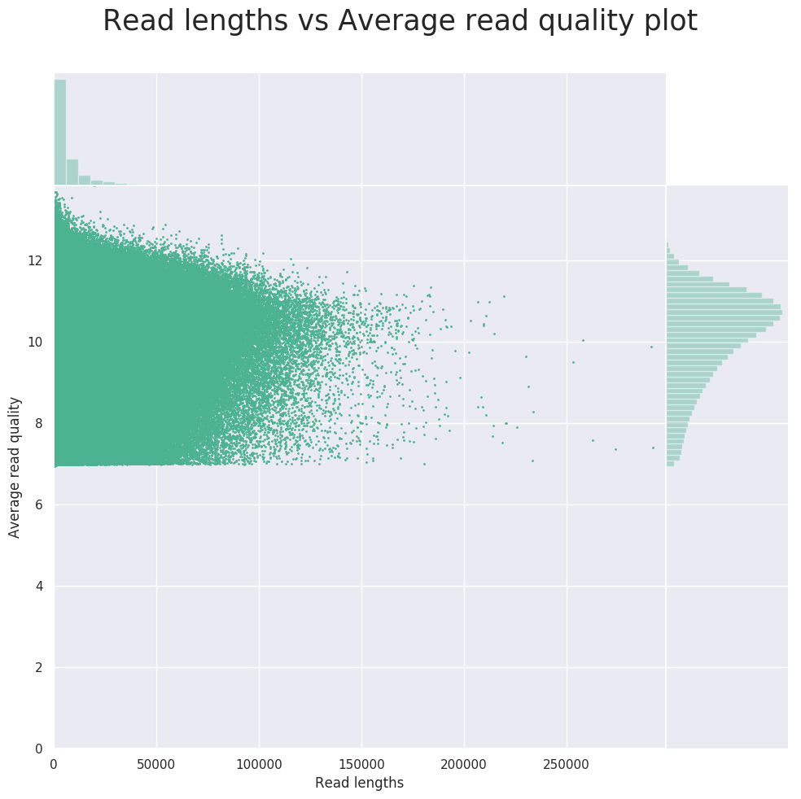
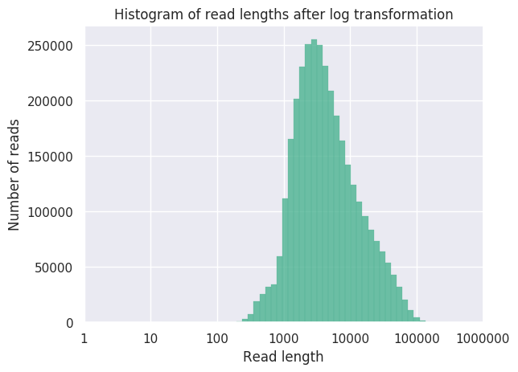

We used NanoStat for data QC and statistics gathering and NanoPlot for visualisation. These tools are from [nanopack tools](https://github.com/wdecoster/nanopack)

### NanoStat
```
READS=[filename of ONT data .fastq]
OUTDIR=[path to output]

NanoStat --fastq $READS --outdir $OUTDIR
```
Nanostat outputs main statistics for the read data. Example from our library:

```
General summary:        
Mean read length:                 8,509.6
Mean read quality:                   10.1
Median read length:               3,833.0
Median read quality:                 10.3
Number of reads:              3,299,012.0
Read length N50:                 19,315.0
Total bases:             28,073,279,865.0
Number, percentage and megabases of reads above quality cutoffs
>Q5:	3299012 (100.0%) 28073.3Mb
>Q7:	3297112 (99.9%) 28059.2Mb
>Q10:	1994146 (60.4%) 17513.7Mb
>Q12:	34417 (1.0%) 202.7Mb
>Q15:	0 (0.0%) 0.0Mb
Top 5 highest mean basecall quality scores and their read lengths
1:	13.8 (19847)
2:	13.7 (924)
3:	13.7 (576)
4:	13.7 (1109)
5:	13.6 (1416)
Top 5 longest reads and their mean basecall quality score
1:	298483 (9.9)
2:	292246 (7.4)
3:	291487 (9.9)
4:	273986 (7.4)
5:	262854 (7.6)
```
### NanoPlot

```
READS=[filename of ONT data .fastq]
OUTDIR=[path to output]

NanoPlot --raw -o $OUTDIR -f png,tiff --fastq $READS 
```

Example of output plots:


